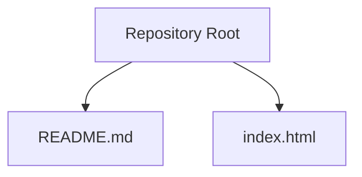
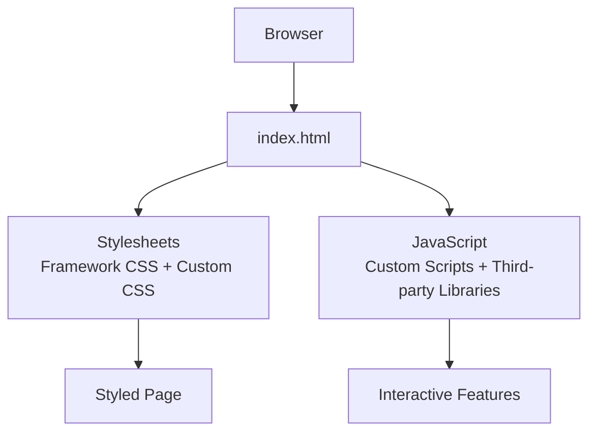
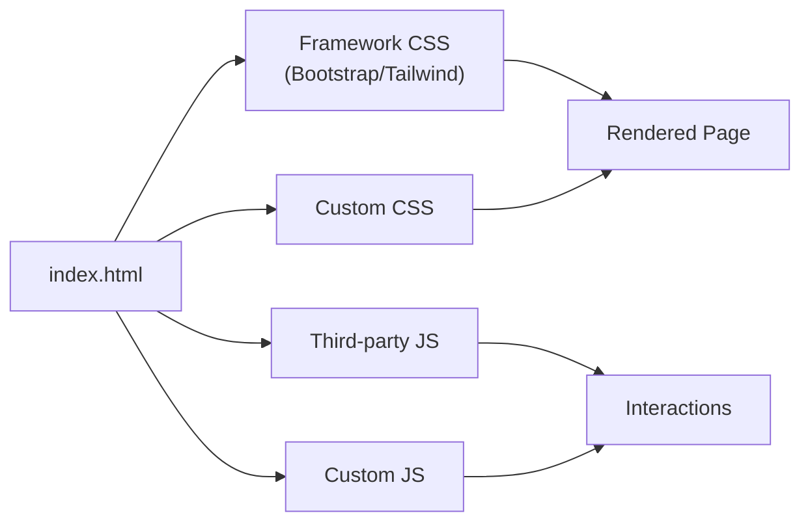

# Customization Guide

<cite>
**Referenced Files in This Document**   
- [README.md](file://README.md)
- [index.html](file://index.html)
</cite>

## Table of Contents
1. [Introduction](#introduction)
2. [Project Structure](#project-structure)
3. [Core Components](#core-components)
4. [Architecture Overview](#architecture-overview)
5. [Detailed Component Analysis](#detailed-component-analysis)
6. [Dependency Analysis](#dependency-analysis)
7. [Performance Considerations](#performance-considerations)
8. [Troubleshooting Guide](#troubleshooting-guide)
9. [Conclusion](#conclusion)
10. [Appendices](#appendices)

## Introduction
This guide explains how to customize the study-sprint template, focusing on modifying index.html to add content, integrate CSS frameworks (Bootstrap or Tailwind), and implement JavaScript functionality. It also covers best practices for organizing stylesheets and scripts, managing external resources, implementing responsive design, adding navigation, creating forms, integrating third-party libraries, optimizing performance, ensuring accessibility, and migrating the template into a production-ready application.

## Project Structure
The repository currently contains:
- README.md: A minimal project readme.
- index.html: The main entry point for the web page.

**Diagram sources**
- [README.md:1-2](file://README.md#L1-L2)
- [index.html:1-1](file://index.html#L1-L1)

**Section sources**
- [README.md:1-2](file://README.md#L1-L2)
- [index.html:1-1](file://index.html#L1-L1)

## Core Components
- index.html: Serves as the single-page entry point where you will structure your HTML, link stylesheets, and include scripts.
- README.md: Provides basic project metadata; you can extend it with setup instructions and usage notes.

Key responsibilities:
- index.html: Define semantic markup, connect CSS/JS assets, and host all interactive behavior.
- README.md: Document project purpose, installation steps, and customization notes.

**Section sources**
- [index.html:1-1](file://index.html#L1-L1)
- [README.md:1-2](file://README.md#L1-L2)

## Architecture Overview
At a high level, the template is a simple static site:
- Browser loads index.html.
- Stylesheets are applied from linked CSS files or CDN-hosted frameworks.
- JavaScript runs after DOM load to enhance interactivity.

[No sources needed since this diagram shows conceptual workflow, not actual code structure]

## Detailed Component Analysis

### Modifying index.html
- Add content: Insert semantic elements such as header, nav, main, section, article, aside, and footer to organize content clearly.
- Integrate CSS frameworks:
  - Bootstrap: Include the Bootstrap CSS via CDN in the document head and optionally the Bootstrap JS bundle before closing body tag.
  - Tailwind: Include the Tailwind CSS CDN script in the document head for quick prototyping, or set up a build step for production.
- Implement JavaScript:
  - Link custom scripts at the end of the body to avoid render-blocking.
  - Use event delegation and modular functions to keep code maintainable.
  - Initialize third-party libraries after DOM ready.

Best practices:
- Keep index.html lean; move complex logic into separate .js files.
- Organize styles in a dedicated CSS file(s) and import framework CSS once.
- Use semantic HTML and ARIA attributes for accessibility.

**Section sources**
- [index.html:1-1](file://index.html#L1-L1)

### Integrating CSS Frameworks

#### Bootstrap Integration
- Add the Bootstrap CSS link in the head.
- Optionally add the Bootstrap JS bundle near the closing body tag.
- Use Bootstrap grid and components for layout and UI elements.

Considerations:
- Ensure viewport meta tag is present for responsiveness.
- Avoid overriding core Bootstrap classes unless necessary.

#### Tailwind Integration
- For rapid development, include the Tailwind CDN script in the head.
- For production, configure Tailwind with a build tool to purge unused styles and optimize output.

Considerations:
- Tailwind’s utility-first approach encourages small, composable classes.
- Maintain a consistent naming strategy for custom utilities if needed.

**Section sources**
- [index.html:1-1](file://index.html#L1-L1)

### Implementing JavaScript Functionality
- Event handling: Attach listeners to buttons, links, and form controls.
- DOM manipulation: Update content dynamically without full page reloads.
- API integration: Fetch data using fetch() and update the UI accordingly.
- Library initialization: Initialize modals, carousels, charts, etc., after DOM ready.

Patterns:
- Encapsulate features in modules or IIFEs to avoid global namespace pollution.
- Debounce/throttle expensive operations like scroll or resize handlers.

**Section sources**
- [index.html:1-1](file://index.html#L1-L1)

### Structuring Custom Code and Assets
Recommended organization:
- css/: Stylesheets including framework overrides and custom styles.
- js/: JavaScript modules and vendor scripts.
- img/, fonts/, assets/: Static resources.

File naming:
- Use descriptive names and kebab-case for files.
- Separate vendor scripts from app-specific code.

Import order:
- Load CSS early; defer non-critical JS.
- Load critical inline CSS for above-the-fold content when necessary.

**Section sources**
- [index.html:1-1](file://index.html#L1-L1)

### Managing External Resources
- Prefer HTTPS CDNs for frameworks and libraries.
- Provide local fallbacks for critical resources.
- Cache bust by appending version query strings or hashed filenames.
- Audit dependencies regularly for security and updates.

**Section sources**
- [index.html:1-1](file://index.html#L1-L1)

### Responsive Design Implementation
- Use a viewport meta tag.
- Leverage framework grids (Bootstrap/Tailwind) for fluid layouts.
- Apply media queries for breakpoints beyond framework defaults.
- Test across devices and orientations.

**Section sources**
- [index.html:1-1](file://index.html#L1-L1)

### Adding Navigation
- Create a semantic nav element with accessible links.
- Implement mobile-friendly toggles using framework components or custom JS.
- Ensure keyboard navigation and focus management.

**Section sources**
- [index.html:1-1](file://index.html#L1-L1)

### Creating Forms
- Use semantic form elements: label, input, select, textarea, fieldset, legend.
- Add validation attributes and custom validation messages.
- Handle submissions via AJAX or server endpoints.
- Provide clear error states and success feedback.

**Section sources**
- [index.html:1-1](file://index.html#L1-L1)

### Integrating Third-Party Libraries
- Choose lightweight, well-maintained libraries.
- Initialize libraries after DOM ready.
- Wrap library calls in try/catch and handle errors gracefully.
- Monitor performance impact and remove unused features.

**Section sources**
- [index.html:1-1](file://index.html#L1-L1)

### Accessibility Considerations
- Use semantic HTML and proper heading hierarchy.
- Add alt text for images and captions for media.
- Ensure sufficient color contrast and focus indicators.
- Provide ARIA roles and labels where needed.
- Test with screen readers and keyboard-only navigation.

**Section sources**
- [index.html:1-1](file://index.html#L1-L1)

### Performance Optimization Techniques
- Minify and compress CSS/JS.
- Defer non-critical scripts and preload critical resources.
- Optimize images (WebP/AVIF) and use lazy loading.
- Enable caching headers and CDN delivery.
- Reduce third-party library footprint.

**Section sources**
- [index.html:1-1](file://index.html#L1-L1)

### Migration to Production-Ready Application
Steps:
- Set up a build pipeline (Vite, Webpack, or similar).
- Configure asset optimization, minification, and tree-shaking.
- Move custom CSS/JS into organized directories.
- Introduce environment-based configuration.
- Add linting, formatting, and testing.
- Deploy via CI/CD to a hosting platform.

Checklist:
- Security headers and CSP configured.
- Analytics and tracking integrated securely.
- Error monitoring enabled.
- Documentation updated in README.md.

**Section sources**
- [README.md:1-2](file://README.md#L1-L2)
- [index.html:1-1](file://index.html#L1-L1)

## Dependency Analysis
Conceptual dependency flow for a customized template:

[No sources needed since this diagram shows conceptual workflow, not actual code structure]

## Performance Considerations
- Prioritize critical rendering path: inline minimal CSS, defer JS.
- Use modern image formats and responsive images.
- Avoid heavy animations on low-power devices.
- Monitor network requests and eliminate bottlenecks.
- Regularly audit third-party scripts for performance impact.

[No sources needed since this section provides general guidance]

## Troubleshooting Guide
Common issues and resolutions:
- Styles not applying: Verify CSS paths and load order; ensure no conflicting rules.
- JS errors: Check console for exceptions; confirm DOM readiness before initialization.
- Broken links: Validate URLs and resource availability; provide fallbacks.
- Accessibility failures: Run automated checks and manual tests with assistive tech.
- Performance regressions: Use browser dev tools to identify slow scripts and large assets.

**Section sources**
- [index.html:1-1](file://index.html#L1-L1)

## Conclusion
By following this guide, you can effectively customize the study-sprint template: structure your HTML, integrate CSS frameworks, implement robust JavaScript, organize assets, optimize performance, and ensure accessibility. With these practices, you can evolve the template into a scalable, production-ready application.

[No sources needed since this section summarizes without analyzing specific files]

## Appendices

### Practical Examples Reference
- Responsive layout: Use framework grid classes and media queries.
- Navigation: Semantic nav with accessible links and mobile toggle.
- Forms: Semantic inputs with validation and user feedback.
- Third-party libraries: Initialize after DOM ready and wrap in error handling.

[No sources needed since this section provides general guidance]