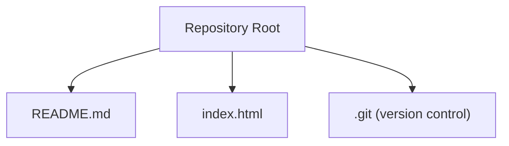
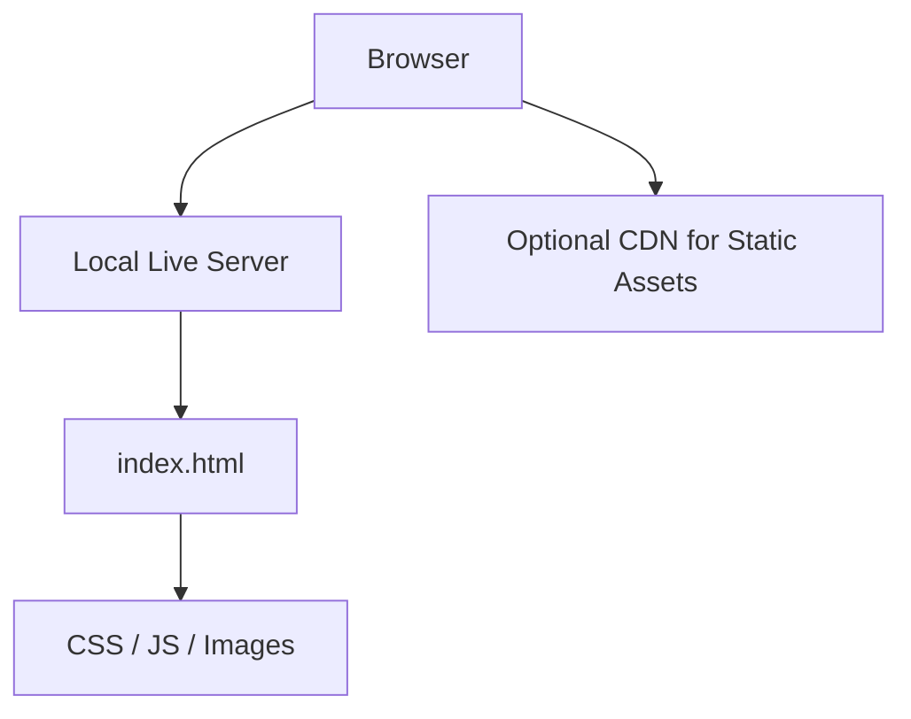

# Development Workflow

<cite>
**Referenced Files in This Document**   
- [README.md](file://README.md)
- [index.html](file://index.html)
</cite>

## Table of Contents
1. [Introduction](#introduction)
2. [Project Structure](#project-structure)
3. [Core Components](#core-components)
4. [Architecture Overview](#architecture-overview)
5. [Detailed Component Analysis](#detailed-component-analysis)
6. [Dependency Analysis](#dependency-analysis)
7. [Performance Considerations](#performance-considerations)
8. [Troubleshooting Guide](#troubleshooting-guide)
9. [Conclusion](#conclusion)
10. [Appendices](#appendices)

## Introduction
This document provides a practical development workflow for the study-sprint template. It focuses on:
- Local development using simple tools (live servers or direct browser loading)
- Testing approaches suitable for static HTML pages
- Deployment options from basic file hosting to CI/CD pipelines
- Version control best practices with Git, branching strategies, and collaboration workflows
- Build processes for production optimization and asset management
- Debugging techniques and recommended development tools

The repository currently contains a minimal structure with an index page and a README. The guidance below is designed to scale as your project grows while keeping setup straightforward.

**Section sources**
- [README.md:1-2](file://README.md#L1-L2)
- [index.html:1-1](file://index.html#L1-L1)

## Project Structure
At present, the project includes:
- A root-level README describing the project
- An index.html entry point for the web application
- A Git repository initialized at the root

**Diagram sources**
- [README.md:1-2](file://README.md#L1-L2)
- [index.html:1-1](file://index.html#L1-L1)

As you add features, consider organizing assets under folders such as css/, js/, images/, and components/. Keep index.html as the main entry point and reference assets via relative paths.

**Section sources**
- [README.md:1-2](file://README.md#L1-L2)
- [index.html:1-1](file://index.html#L1-L1)

## Core Components
- Entry Point: index.html serves as the primary page for the application.
- Documentation: README.md holds project information and can be expanded with setup instructions, usage examples, and contribution guidelines.

For a static site, these two files are sufficient to start. You can extend functionality by adding CSS, JavaScript, and additional HTML pages referenced from index.html.

**Section sources**
- [index.html:1-1](file://index.html#L1-L1)
- [README.md:1-2](file://README.md#L1-L2)

## Architecture Overview
A typical static site architecture for this template follows a simple client-side model:

- Local Live Server: Serves files over HTTP to avoid file:// restrictions and enable live reload.
- Assets: Styles, scripts, and media referenced by index.html.
- Optional CDN: For production distribution of static assets.

[No sources needed since this diagram shows conceptual workflow, not actual code structure]

## Detailed Component Analysis

### Local Development Setup
Recommended approaches:
- Direct browser loading: Open index.html directly in a browser. Useful for quick checks but may have limitations with certain APIs (e.g., fetch, CORS).
- Local live server: Use a lightweight HTTP server with live reload to simulate production behavior and improve developer experience.

Steps:
1. Install a local server tool if desired (for example, a Node-based live server or a VS Code extension).
2. Start the server and open the provided URL in your browser.
3. Edit index.html and related assets; observe changes instantly with live reload.

Tips:
- Prefer HTTP over file:// to avoid security restrictions.
- Keep asset paths relative to index.html for portability.

[No sources needed since this section provides general guidance]

### Testing Approaches for Static HTML Pages
Manual testing:
- Visual inspection across browsers and devices.
- Validate markup and accessibility using built-in browser tools.
- Test user flows by interacting with forms, links, and UI elements.

Automated testing (lightweight):
- HTML validation: Run automated checks against W3C standards.
- Accessibility audits: Use automated linters to catch common issues.
- Basic functional tests: If you add JavaScript, use a headless browser to verify critical interactions.

Suggested workflow:
- Add a test script to your package configuration that runs validators and accessibility checks.
- Integrate these checks into pre-commit hooks or CI pipelines.

[No sources needed since this section provides general guidance]

### Deployment Options
Simple file hosting:
- Upload index.html and assets to any static file host (e.g., GitHub Pages, Netlify Drop, Vercel static sites, or a shared drive served via HTTP).

Advanced CI/CD pipelines:
- Automate build steps (if any), validation, and deployment on push or pull request events.
- Cache dependencies and artifacts to speed up builds.
- Configure environment-specific settings and secrets securely.

Deployment checklist:
- Ensure all asset paths are correct and relative.
- Minify and optimize assets where applicable.
- Set appropriate caching headers for static content.

[No sources needed since this section provides general guidance]

### Version Control Best Practices with Git
Branching strategy:
- main: Stable, deployable code.
- develop: Integration branch for ongoing work.
- feature/*: Isolated branches for specific features or fixes.

Collaboration workflow:
- Create a feature branch from develop.
- Commit small, focused changes with clear messages.
- Open pull requests for review before merging.
- Resolve conflicts early and keep histories clean.

Pre-commit and CI:
- Enforce linting and validation via hooks and CI.
- Require passing checks before merging.

[No sources needed since this section provides general guidance]

### Build Processes for Production Optimization and Asset Management
If you introduce more assets or scripts:
- Minification: Reduce CSS and JS sizes.
- Concatenation: Combine small files to reduce HTTP requests.
- Image optimization: Compress and convert to modern formats.
- Asset hashing: Enable cache busting for long-term caching.
- Source maps: Generate for debugging in production when necessary.

Tooling suggestions:
- Use a simple bundler or task runner to automate minification and optimization.
- Configure output directories and asset manifests for deployment.

[No sources needed since this section provides general guidance]

### Debugging Techniques and Development Tools
Browser Developer Tools:
- Elements panel: Inspect DOM and styles.
- Console: View logs and errors.
- Network panel: Monitor requests and performance.
- Application panel: Inspect storage and service workers.

Accessibility and Quality:
- Lighthouse: Performance, accessibility, SEO, and best practices audits.
- HTML validator: Check markup correctness.
- Color contrast checkers: Ensure readability.

Workflow tips:
- Use console logging sparingly and remove verbose logs before release.
- Capture screenshots or recordings for bug reports.
- Reproduce issues in incognito mode to rule out extensions.

[No sources needed since this section provides general guidance]

## Dependency Analysis
Current state:
- No external libraries are referenced in the minimal index page.
- The project relies on standard web platform capabilities.

Future considerations:
- If you add third-party libraries, track versions and licenses.
- Prefer stable releases and pin versions to ensure reproducible builds.
- Regularly update dependencies and run security scans.

[No sources needed since this section provides general guidance]

## Performance Considerations
- Keep initial payload small; defer non-critical scripts.
- Optimize images and fonts; use responsive images where appropriate.
- Leverage browser caching with immutable filenames for static assets.
- Measure performance regularly with Lighthouse and real-user metrics.

[No sources needed since this section provides general guidance]

## Troubleshooting Guide
Common issues and resolutions:
- Assets not loading: Verify relative paths and MIME types.
- CORS errors: Serve via HTTP and configure proper headers.
- Mixed content warnings: Ensure all resources load over HTTPS.
- Caching problems: Clear cache or use cache-busting strategies.

Diagnostic steps:
- Use Network panel to inspect failed requests.
- Validate HTML and CSS to eliminate syntax errors.
- Test in multiple browsers to identify compatibility issues.

[No sources needed since this section provides general guidance]

## Conclusion
This guide outlines a streamlined development workflow for the study-sprint template, starting from local development with simple tools through testing, deployment, version control, and performance optimization. As the project evolves, adopt incremental improvements—such as automated validation, CI/CD, and asset optimization—to maintain quality and velocity.

[No sources needed since this section summarizes without analyzing specific files]

## Appendices

### Quick Start Checklist
- Open index.html in a browser or start a local live server.
- Add CSS and JS files as needed; reference them from index.html.
- Run manual tests across browsers and devices.
- Set up Git branching and pull request reviews.
- Deploy to a static host or configure CI/CD for automation.

[No sources needed since this section provides general guidance]