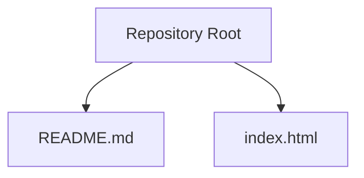

# Getting Started

<cite>
**Referenced Files in This Document**   
- [README.md](file://README.md)
- [index.html](file://index.html)
</cite>

## Table of Contents
1. [Introduction](#introduction)
2. [Project Structure](#project-structure)
3. [Prerequisites](#prerequisites)
4. [Installation and Setup](#installation-and-setup)
5. [Running Locally](#running-locally)
6. [Understanding the Template](#understanding-the-template)
7. [First Steps: Modify, Style, and Add JavaScript](#first-steps-modify-style-and-add-javascript)
8. [Troubleshooting Guide](#troubleshooting-guide)
9. [Next Steps](#next-steps)
10. [Conclusion](#conclusion)

## Introduction
This guide helps you get started with the study-sprint template quickly. You will learn how to install the project, open it in a browser, understand the initial structure, and make your first changes to HTML, CSS, and JavaScript. The goal is to have a working local page as fast as possible, then build on that foundation.

## Project Structure
The repository is intentionally minimal so you can focus on learning and experimenting. It contains:
- README.md: A short project description file.
- index.html: The main entry point for your web page.

**Diagram sources**
- [README.md:1-2](file://README.md#L1-L2)
- [index.html:1-1](file://index.html#L1-L1)

**Section sources**
- [README.md:1-2](file://README.md#L1-L2)
- [index.html:1-1](file://index.html#L1-L1)

## Prerequisites
- A modern web browser (Chrome, Firefox, Edge, or Safari).
- A basic text editor or code editor (for example, VS Code, Sublime Text, or Notepad++).
- Basic familiarity with HTML, CSS, and JavaScript is helpful but not required.

No server setup or package manager is required to run this template locally.

## Installation and Setup
Follow these steps to set up the project on your computer:

1. Clone the repository
   - Open your terminal or command prompt.
   - Run: git clone https://github.com/your-org/study-sprint.git
   - Navigate into the project folder: cd study-sprint

2. Verify files are present
   - Confirm that both README.md and index.html exist in the root directory.

3. Open the project in your editor
   - In your editor, open the study-sprint folder.
   - Open index.html to start editing.

Notes:
- If you do not use Git, you can also download the repository as a ZIP file from GitHub and extract it.

**Section sources**
- [README.md:1-2](file://README.md#L1-L2)
- [index.html:1-1](file://index.html#L1-L1)

## Running Locally
You can view the page directly in your browser without installing any tools:

- Double-click index.html in your file explorer to open it in the default browser.
- Alternatively, right-click index.html and choose Open with > your preferred browser.

If you prefer using a simple local server (recommended for some advanced features like modules or fetch):
- Using Python: python -m http.server 8000, then open http://localhost:8000/index.html in your browser.
- Using Node.js: npx serve ., then open http://localhost:3000/index.html in your browser.

Tip: Opening index.html directly works for most static pages. Use a local server if you encounter issues with certain APIs or features.

## Understanding the Template
The template provides an empty HTML5 document structure. When you open index.html, you will see a standard skeleton that includes:
- The HTML5 doctype declaration.
- The <html>, <head>, and <body> elements.
- A <title> element for the browser tab.
- Optional meta tags for character encoding and viewport settings.

What this means for you:
- The page is ready to accept content inside the <body>.
- You can add styles in a <style> block within <head> or link an external stylesheet.
- You can add scripts at the end of <body> or link an external script file.

To begin, open index.html in your editor and locate the <body> section where you will add your content.

**Section sources**
- [index.html:1-1](file://index.html#L1-L1)

## First Steps: Modify, Style, and Add JavaScript
Here are simple, beginner-friendly tasks to customize the template:

1. Add content
   - Inside the <body>, add a heading and a paragraph to confirm your edits work.
   - Save the file and refresh the browser to see changes.

2. Add styling
   - Add a <style> block inside <head> to change colors, fonts, or layout.
   - Or create a separate file named style.css and link it from <head> using a <link rel="stylesheet"> tag.

3. Add JavaScript functionality
   - Create a file named script.js and link it at the end of <body> using a  tag.
   - In script.js, write a small interaction, such as changing text when a button is clicked.

4. Organize assets
   - For images, create an assets/images folder and reference them with relative paths.
   - Keep your project tidy by grouping related files together.

Example workflow:
- Edit index.html to include a heading and a button.
- Add a <style> block or link style.css to style the heading and button.
- Link script.js to add click behavior to the button.
- Refresh the browser to test your changes.

Note: Avoid pasting large amounts of code directly into the browser console for persistent changes; edit the files in your editor instead.

[No sources needed since this section provides general guidance]

## Troubleshooting Guide
Common issues and quick fixes:

- The page does not load or shows blank
  - Ensure index.html exists in the project root.
  - Make sure your browser is opening index.html, not another file.
  - Clear the browser cache or try an incognito window.

- Styles or scripts do not apply
  - Check that the path to your CSS or JS file is correct and matches the actual file name and case.
  - If linking external files, ensure they are saved in the same folder or provide the correct relative path.

- Local server issues
  - If using a local server, verify the port number and URL match what you typed in the browser.
  - Try stopping and restarting the server after making changes.

- Permissions or read-only errors
  - Make sure the folder is writable by your user account.
  - If editing from a downloaded ZIP, move the folder out of the Downloads location if your OS restricts writes there.

- Browser security restrictions
  - Some features (like fetching remote data) may require a local server rather than opening index.html directly.
  - Check the browser’s developer console for error messages and follow their guidance.

Tips:
- Use the browser’s developer tools (F12) to inspect elements, check for errors, and debug JavaScript.
- Validate your HTML using an online validator if the page does not render as expected.

[No sources needed since this section provides general guidance]

## Next Steps
Once your page is running:
- Experiment with more HTML elements (lists, links, images, forms).
- Learn CSS basics (selectors, box model, flexbox, grid).
- Practice JavaScript fundamentals (variables, functions, DOM manipulation).
- Explore responsive design techniques to support mobile devices.
- Consider adding a simple build step later (for example, minification or bundling) as your project grows.

[No sources needed since this section provides general guidance]

## Conclusion
You now have everything you need to install, open, and customize the study-sprint template. Start by editing index.html, add your own content and styles, and gradually introduce JavaScript as you become comfortable. Use the troubleshooting tips above if you run into common setup issues, and keep iterating until your page looks and behaves the way you want.

[No sources needed since this section summarizes without analyzing specific files]