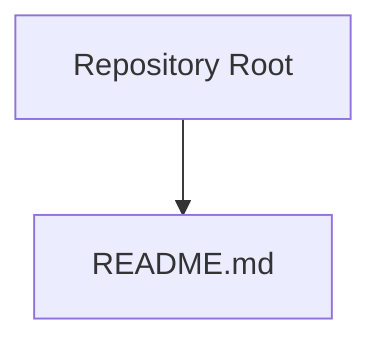
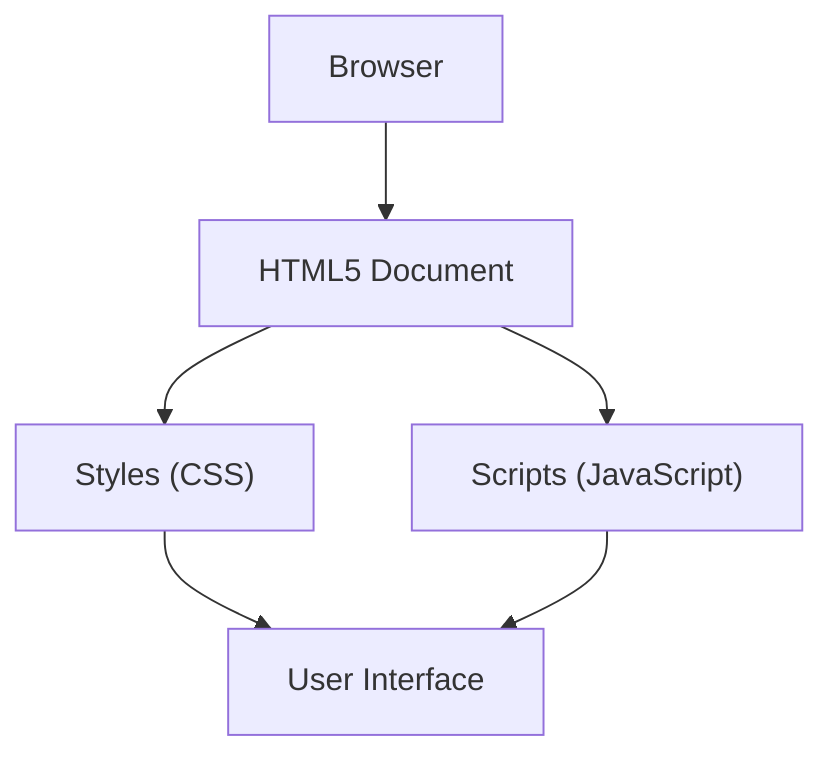
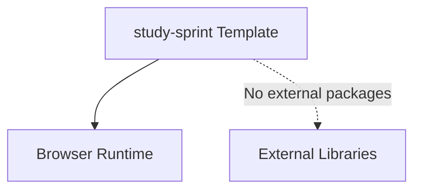

# Project Overview

<cite>
**Referenced Files in This Document**
- [README.md](file://README.md)
</cite>

## Table of Contents
1. [Introduction](#introduction)
2. [Project Structure](#project-structure)
3. [Core Components](#core-components)
4. [Architecture Overview](#architecture-overview)
5. [Detailed Component Analysis](#detailed-component-analysis)
6. [Dependency Analysis](#dependency-analysis)
7. [Performance Considerations](#performance-considerations)
8. [Troubleshooting Guide](#troubleshooting-guide)
9. [Conclusion](#conclusion)

## Introduction
study-sprint is a minimalist HTML5 template intended to serve as a clean, zero-dependency starting point for web development projects. It emphasizes simplicity and clarity so that learners can focus on core web fundamentals—HTML structure, CSS styling, and JavaScript behavior—without the overhead of frameworks or toolchains. At the same time, it provides a practical foundation for rapid prototyping: developers can quickly scaffold a new site or application and extend it incrementally.

Key characteristics:
- Zero dependencies: No build tools, package managers, or external libraries are required to get started.
- Simple structure: A straightforward file layout that mirrors common web project conventions.
- Extensibility: Designed to be adapted easily by adding components, styles, scripts, and assets.

Target audience:
- Beginners learning web development who benefit from a minimal, readable codebase.
- Developers seeking a fast, lightweight template to prototype ideas or bootstrap new applications.

Core benefits:
- Simplicity: Reduces cognitive load and accelerates onboarding.
- Flexibility: Adapts to diverse use cases without imposing constraints.
- Educational value: Encourages understanding of foundational web technologies through hands-on experimentation.

## Project Structure
The repository follows a minimal structure centered around a single entry point document. This keeps the project easy to navigate and modify, making it ideal for both learning and quick iteration.

**Diagram sources**
- [README.md:1-2](file://README.md#L1-L2)

**Section sources**
- [README.md:1-2](file://README.md#L1-L2)

## Core Components
As a starter template, study-sprint’s primary “component” is its intentionally small footprint:
- A clear, semantic HTML5 base that demonstrates best practices for page structure.
- An extensible stylesheet area where you can introduce design systems, utility classes, or component styles.
- A script section for vanilla JavaScript, enabling progressive enhancement and interactive features.

This approach ensures that every addition is intentional and visible, reinforcing good habits for maintainable web projects.

[No sources needed since this section provides general guidance]

## Architecture Overview
At a high level, the template represents a flat, client-side architecture with no server-side runtime or build pipeline. The flow is straightforward:
- A browser loads the HTML document.
- Styles define visual presentation and layout.
- Scripts add interactivity and dynamic behavior.

[No sources needed since this diagram shows conceptual workflow, not actual code structure]

## Detailed Component Analysis
Given the minimal nature of the template, detailed analysis focuses on how each layer contributes to the overall experience:

- HTML5 Base: Provides semantic markup and accessibility foundations. Use this as a canvas to learn document structure, headings, sections, forms, and media elements.
- CSS Layer: Introduce responsive design, typography, color systems, and layout techniques such as Flexbox and Grid. Keep styles modular to support future growth.
- JavaScript Layer: Start with simple DOM manipulation and event handling. Gradually adopt patterns like modules or IIFEs to keep code organized as complexity increases.

These layers work together to form a cohesive, extensible foundation suitable for both educational exploration and production-ready prototypes.

[No sources needed since this section provides general guidance]

## Dependency Analysis
The template has no external dependencies, which simplifies setup and reduces maintenance overhead. There are no package manifests, lockfiles, or build configurations to manage. This makes it an excellent choice for environments where speed and simplicity matter most.

[No sources needed since this diagram shows conceptual workflow, not actual code structure]

## Performance Considerations
Because there are no third-party libraries or build steps, the template starts with minimal payload and fast load times. As you add assets and scripts:
- Prefer native browser capabilities before introducing libraries.
- Defer non-critical scripts and optimize images.
- Use caching strategies and content delivery networks when scaling beyond local development.

[No sources needed since this section provides general guidance]

## Troubleshooting Guide
Common issues and resolutions:
- Assets not loading: Verify relative paths and ensure files exist at the expected locations.
- Styles not applying: Check selector specificity and confirm CSS is linked correctly.
- Scripts failing: Inspect the console for errors; validate DOM readiness and event bindings.

[No sources needed since this section provides general guidance]

## Conclusion
study-sprint offers a focused, dependency-free foundation for learning web fundamentals and rapidly prototyping new ideas. Its simplicity lowers barriers to entry while remaining flexible enough to grow into more complex applications. Whether you are exploring the basics of HTML, CSS, and JavaScript or building a quick proof-of-concept, this template provides a clear, extensible starting point.

[No sources needed since this section summarizes without analyzing specific files]