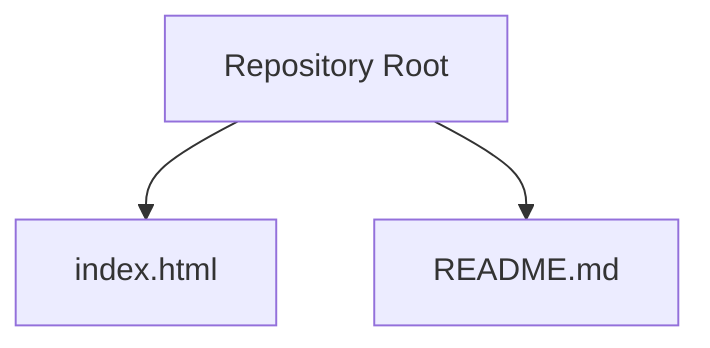
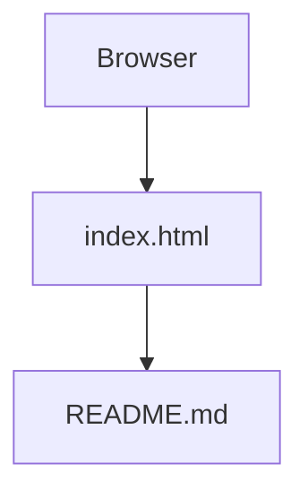
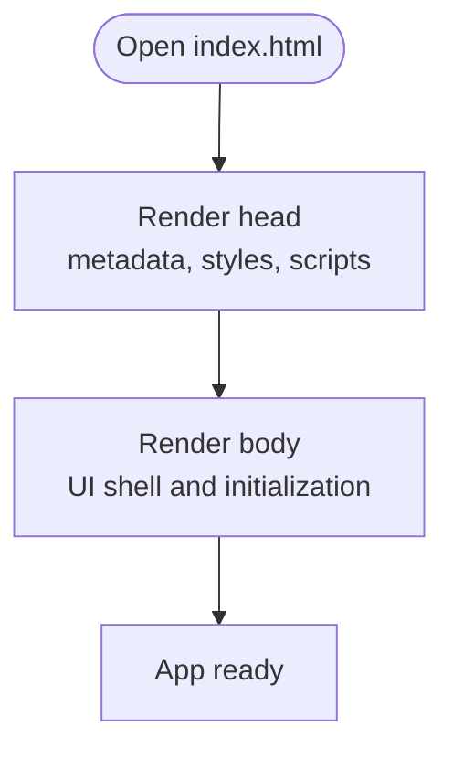
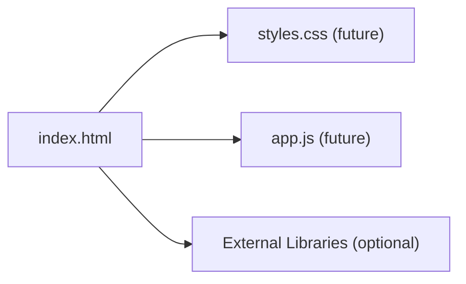

# Project Structure

<cite>
**Referenced Files in This Document**   
- [index.html](file://index.html)
- [README.md](file://README.md)
</cite>

## Table of Contents
1. [Introduction](#introduction)
2. [Project Structure](#project-structure)
3. [Core Components](#core-components)
4. [Architecture Overview](#architecture-overview)
5. [Detailed Component Analysis](#detailed-component-analysis)
6. [Dependency Analysis](#dependency-analysis)
7. [Performance Considerations](#performance-considerations)
8. [Troubleshooting Guide](#troubleshooting-guide)
9. [Conclusion](#conclusion)
10. [Appendices](#appendices)

## Introduction
This document explains the study-sprint project structure and how its minimal, flat organization supports extensibility and integration with other technologies. The repository currently contains two files: index.html as the primary entry point and README.md for documentation. The goal is to provide clear guidance on how to extend this template while preserving simplicity.

## Project Structure
The project uses a flat directory layout at the repository root:
- index.html: Primary web entry point
- README.md: Project documentation

**Diagram sources**
- [index.html:1-1](file://index.html#L1-L1)
- [README.md:1-2](file://README.md#L1-L2)

**Section sources**
- [index.html:1-1](file://index.html#L1-L1)
- [README.md:1-2](file://README.md#L1-L2)

## Core Components
- index.html
  - Role: Serves as the single-page entry point for the application. It should contain the HTML5 document structure (head and body), metadata, and any initial scripts or styles needed to bootstrap the app.
  - Extensibility: Keep it minimal; load external assets via relative paths and defer heavy logic to separate modules when added later.
- README.md
  - Role: Provides project context, setup instructions, and usage notes. It is the first place contributors look for guidance.

Guidelines for maintaining simplicity:
- Prefer adding new files next to index.html initially; only introduce subfolders when there is a clear grouping need.
- Use descriptive file names that reflect purpose (for example, styles.css, app.js).
- Avoid deep nesting; keep related files close to the entry point until scale justifies reorganization.

**Section sources**
- [index.html:1-1](file://index.html#L1-L1)
- [README.md:1-2](file://README.md#L1-L2)

## Architecture Overview
At this stage, the architecture is intentionally minimal:
- A single HTML page acts as the shell.
- Documentation lives alongside the code.
- Future layers (styles, scripts, components) can be introduced without changing the root layout.

[No sources needed since this diagram shows conceptual workflow, not actual code structure]

## Detailed Component Analysis

### index.html
- Purpose: Provide the HTML5 skeleton and serve as the mount point for UI and scripts.
- Recommended structure:
  - head: Title, character encoding, viewport meta, links to CSS, and any early bootstrapping scripts.
  - body: Application container element(s) and script tags to initialize behavior.
- Integration patterns:
  - Load third-party libraries via CDN or local assets.
  - Defer non-critical JavaScript to improve initial load performance.
  - Keep inline content minimal; prefer external files for maintainability.

[No sources needed since this diagram shows conceptual workflow, not actual code structure]

**Section sources**
- [index.html:1-1](file://index.html#L1-L1)

### README.md
- Purpose: Document project goals, setup steps, and usage examples.
- Best practices:
  - Include quickstart instructions.
  - Describe how to run locally and build if applicable.
  - Link to relevant guides or external resources.
  - Keep updates synchronized with code changes.

**Section sources**
- [README.md:1-2](file://README.md#L1-L2)

## Dependency Analysis
Currently, there are no explicit dependencies declared in the repository. When adding assets:
- Place CSS and JS files at the repository root or in clearly named folders.
- Reference them from index.html using relative paths.
- Track external libraries in README.md or a dedicated dependency list.

[No sources needed since this diagram shows conceptual workflow, not actual code structure]

## Performance Considerations
- Keep index.html lightweight; avoid large inline blocks.
- Defer non-critical scripts to reduce blocking during initial render.
- Preload critical resources when necessary.
- Minimize network requests by bundling or combining assets as the project grows.

[No sources needed since this section provides general guidance]

## Troubleshooting Guide
- If the page does not load assets:
  - Verify relative paths in index.html match the actual file locations.
  - Ensure file names and extensions are correct and case-sensitive where required.
- If the site appears blank:
  - Check browser console for errors in scripts or styles.
  - Confirm that the HTML structure includes proper head and body sections.
- If documentation is outdated:
  - Update README.md to reflect current setup and usage.

[No sources needed since this section provides general guidance]

## Conclusion
The study-sprint template starts with a simple, flat structure centered around index.html and README.md. This approach minimizes complexity while allowing straightforward extension. As features grow, introduce organized folders and modular files, but preserve the clarity of the root-level entry point and documentation.

[No sources needed since this section summarizes without analyzing specific files]

## Appendices

### Guidelines for Organizing Future Code Additions
- Naming conventions:
  - Use lowercase with hyphens for directories (for example, components, utils).
  - Use kebab-case for files (for example., main-app.js, base-styles.css).
- Folder organization:
  - Group by feature or layer (for example, views, services, shared).
  - Keep small utilities at the root until they become numerous.
- Entry point hygiene:
  - Keep index.html focused on shell and initialization.
  - Move business logic into separate modules and import them.

[No sources needed since this section provides general guidance]